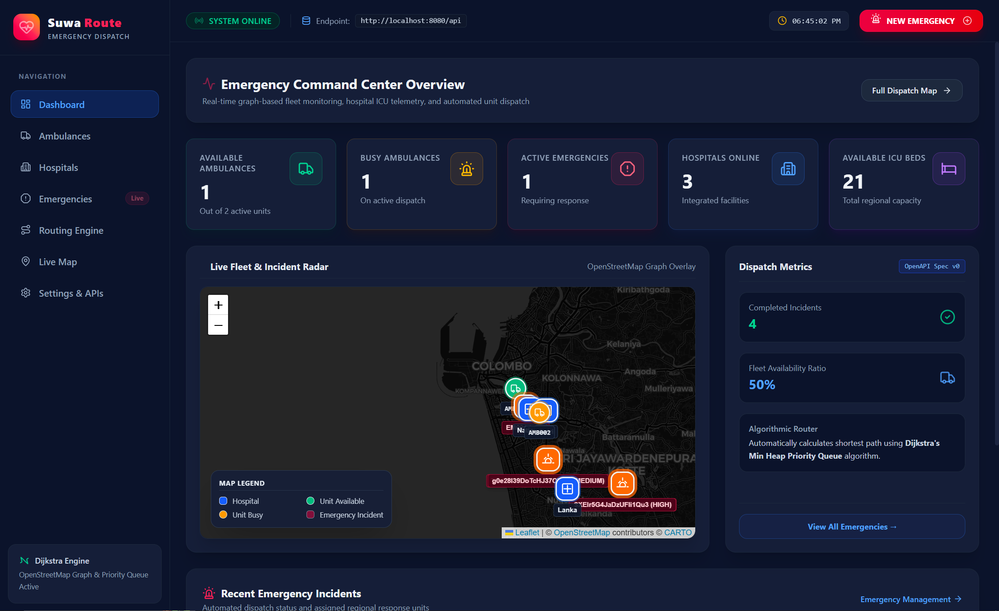
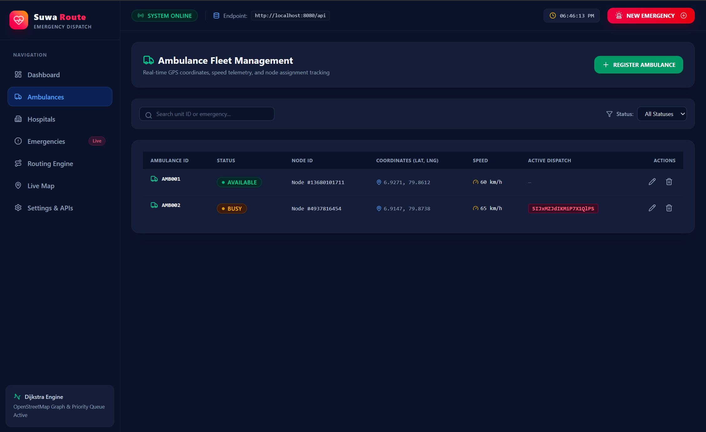
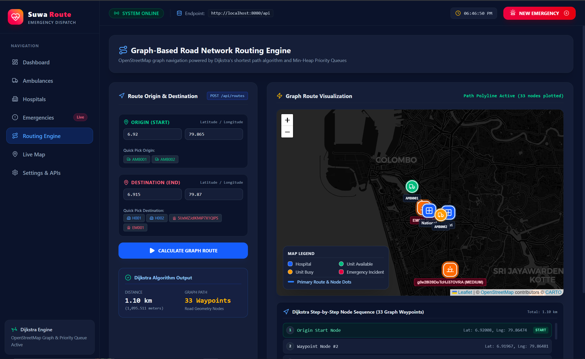
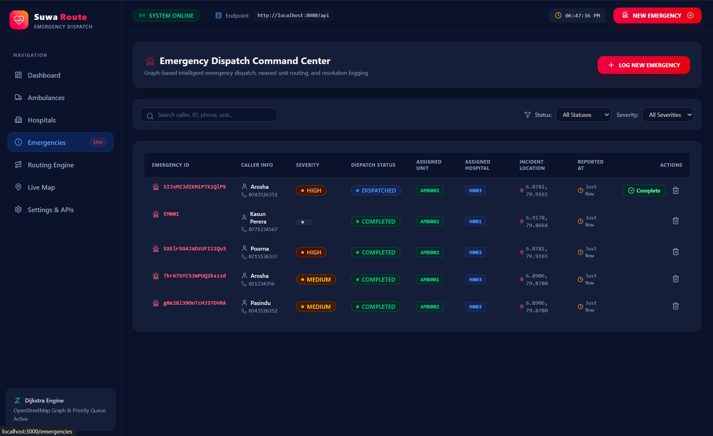

<div align="center">

# 🚑 SuwaRoute

### Smart Ambulance Dispatch & Hospital Optimization System

**Faster Routes • Smarter Dispatch • Better Emergency Response**

<br/>

[](https://www.java.com/)
[](https://spring.io/projects/spring-boot)
[](https://react.dev/)
[](https://maven.apache.org/)
[](./LICENSE)

<br/>

[**View Repository**](https://github.com/Poorna-Raj/SuwaRoute)

</div>

---

## 📖 Overview

**SuwaRoute** is a smart emergency-response system designed to optimize **ambulance dispatching, route selection, and hospital assignment**.

The system applies fundamental **Programming, Data Structures and Algorithms (PDSA)** concepts to a real-world emergency transportation problem.

Instead of treating an ambulance request as a simple nearest-vehicle lookup, SuwaRoute models the road network as a **weighted graph**, calculates efficient routes using **Dijkstra's Algorithm**, and uses **heap-based priority queues** to efficiently manage priority-driven operations.

The result is a system that demonstrates how algorithmic thinking can be applied to improve emergency response workflows.

---

## 🎯 Problem

During an emergency, several decisions may need to happen quickly:

```text
Emergency Request
       │
       ▼
Find Suitable Ambulance
       │
       ▼
Calculate Efficient Route
       │
       ▼
Select Suitable Hospital
       │
       ▼
Dispatch Ambulance
       │
       ▼
Monitor & Reassign
```

Traditional approaches can become inefficient when multiple ambulances, hospitals, routes, and emergency requests need to be considered simultaneously.

**SuwaRoute** addresses this by combining data structures and algorithms with a modern full-stack application.

---

# ✨ Key Features

<table>
<tr>
<td width="50%">

### 🚑 Ambulance Dispatch

Identify and assign suitable ambulances to emergency requests.

### 🗺️ Intelligent Routing

Calculate efficient routes through a weighted graph using Dijkstra's algorithm.

### ⚡ Emergency Prioritization

Process emergency requests according to their priority.

</td>
<td width="50%">

### 🏥 Hospital Optimization

Evaluate suitable hospitals for emergency destinations.

### 🔄 Dynamic Reassignment

Reconsider ambulance assignments when circumstances change.

### 🌐 Interactive Web Interface

Manage the system through a modern React-based interface.

</td>
</tr>
</table>

---

# 🧠 PDSA Implementation

The core purpose of SuwaRoute is to demonstrate the practical use of **data structures and algorithms**.

## Graph Data Structure

The transportation network is represented using a **weighted graph**.

```text
        A
       / \
     10   5
     /     \
    B-------C
     \     /
      8   4
       \ /
        D
```

Where:

* **Vertices** represent locations.
* **Edges** represent roads or connections.
* **Weights** represent distance or travel cost.

This representation allows the application to model real-world road networks.

---

## Dijkstra's Shortest Path Algorithm

SuwaRoute uses **Dijkstra's Algorithm** to determine efficient routes through the transportation graph.

### Why Dijkstra?

Emergency response requires efficient route calculation.

The algorithm repeatedly selects the closest unvisited node and updates the shortest known distances to neighboring nodes.

### Complexity

With a heap-based priority queue:

```text
Time Complexity
O((V + E) log V)
```

Where:

* `V` = number of vertices
* `E` = number of edges

This provides an efficient approach for weighted graphs with non-negative edge weights.

---

## Heap-Based Priority Queue

A **Priority Queue** backed by a heap is used to efficiently process elements based on priority.

This is particularly useful when:

* Multiple emergencies occur.
* Requests have different priorities.
* The shortest-path algorithm needs efficient minimum-distance extraction.
* The system needs to dynamically reorder operations.

Conceptually:

```text
        Priority Queue
       ┌─────────────┐
       │ Emergency A │ ← Highest Priority
       ├─────────────┤
       │ Emergency B │
       ├─────────────┤
       │ Emergency C │
       └─────────────┘
```

---

# 🏗️ System Architecture

SuwaRoute follows a full-stack architecture:

```text
┌───────────────────────────────────────────┐
│                 FRONTEND                  │
│                                           │
│                 React                     │
│          User Interface / Views           │
└───────────────────┬───────────────────────┘
                    │
                    │ REST API
                    ▼
┌───────────────────────────────────────────┐
│                 BACKEND                   │
│                                           │
│              Spring Boot                 │
│          Business Logic / APIs            │
└───────────────────┬───────────────────────┘
                    │
          ┌─────────┼─────────┐
          │         │         │
          ▼         ▼         ▼
       Graph     Priority   Ambulance
     Algorithms    Queue    Management
          │         │         │
          └─────────┼─────────┘
                    ▼
          Route & Dispatch Engine
```

---

# 🛠️ Technology Stack

| Layer               | Technology            |
| ------------------- | --------------------- |
| Frontend            | React                 |
| Backend             | Java + Spring Boot    |
| Build Tool          | Maven                 |
| Routing             | Dijkstra's Algorithm  |
| Data Structure      | Graph                 |
| Priority Management | Heap / Priority Queue |
| Version Control     | Git + GitHub          |
| Documentation       | Markdown              |

---

# 📂 Project Structure

```text
SuwaRoute/
│
├── backend/
│   ├── src/
│   ├── pom.xml
│   └── ...
│
├── frontend/
│   ├── src/
│   ├── package.json
│   └── ...
│
├── docs/
│   └── Project documentation
│
├── .gitignore
├── LICENSE
└── README.md
```

---

# 🔄 How It Works

### Step 1 — Emergency Request

An emergency request is created with the required location and priority information.

### Step 2 — Find Available Ambulances

The system identifies ambulances that can potentially respond to the request.

### Step 3 — Build / Query the Road Graph

Locations and roads are represented using a weighted graph.

### Step 4 — Calculate Route

Dijkstra's algorithm calculates an efficient route through the graph.

### Step 5 — Evaluate Hospital

Potential hospitals can be evaluated according to the available system information.

### Step 6 — Dispatch

The selected ambulance is assigned to the emergency.

### Step 7 — Dynamic Reassignment

If conditions change, the system can reconsider assignments and update the dispatch decision.

---

# 📸 Screenshots

> Replace the placeholders below with screenshots from the actual application.

### Dashboard



### Ambulance Management



### Route Optimization



### Emergency Management



> **Tip:** Create a `docs/screenshots/` folder and add your actual screenshots there.

---

# 🚀 Getting Started

## Prerequisites

Make sure the following are installed:

* Java JDK 17+
* Maven
* Node.js
* npm
* Git

---

## 1. Clone the Repository

```bash
git clone https://github.com/Poorna-Raj/SuwaRoute.git

cd SuwaRoute
```

---

## 2. Run the Backend

```bash
cd backend
```

Build the application:

```bash
mvn clean install
```

Run Spring Boot:

```bash
mvn spring-boot:run
```

The backend will start on the configured Spring Boot port.

---

## 3. Run the Frontend

Open a new terminal:

```bash
cd frontend
```

Install dependencies:

```bash
npm install
```

Start the development server:

```bash
npm run dev
```

Open the local URL displayed by the development server.

---

# 🧪 Testing Scenarios

The system can be evaluated using different emergency scenarios.

| Scenario              | Expected Behaviour                     |
| --------------------- | -------------------------------------- |
| One emergency         | Assign a suitable available ambulance  |
| Multiple emergencies  | Process requests according to priority |
| Multiple routes       | Calculate efficient routes             |
| Multiple hospitals    | Evaluate suitable hospital options     |
| Ambulance unavailable | Consider another available ambulance   |
| Dynamic situation     | Recalculate/reassign where supported   |

---

# 📊 Algorithmic Analysis

| Component            | Data Structure / Algorithm | Purpose                             |
| -------------------- | -------------------------- | ----------------------------------- |
| Road Network         | Graph                      | Represent locations and roads       |
| Route Finding        | Dijkstra                   | Find shortest/efficient paths       |
| Priority Handling    | Heap / Priority Queue      | Efficient priority-based processing |
| Ambulance Assignment | Collections + Algorithms   | Identify suitable resources         |
| Dynamic Dispatch     | Algorithmic reassignment   | Adapt to changing conditions        |

---

# 🎓 Academic Context

This project was developed as part of a **Programming, Data Structures and Algorithms (PDSA)** coursework project.

The project focuses on applying theoretical concepts to a practical software engineering problem.

### Learning Outcomes Demonstrated

* Understanding and implementation of data structures
* Application of graph theory
* Shortest-path algorithm implementation
* Priority queue and heap concepts
* Algorithm complexity analysis
* Object-oriented programming
* Backend API development
* Frontend application development
* Full-stack system integration
* Git-based collaborative development

---

# 🔮 Future Improvements

Potential future enhancements include:

* 📍 Real-time GPS tracking
* 🚦 Traffic-aware route optimization
* 🗺️ Live map integration
* 📱 Mobile application
* 🔔 Real-time emergency notifications
* 📊 Emergency response analytics
* 🤖 Predictive ambulance positioning
* 🏥 Real-time hospital capacity integration
* 🌐 Cloud deployment
* 🔐 Role-based authentication

---

# 👥 Contributors

Developed collaboratively as part of the PDSA coursework.

### SuwaRoute Team

* **Poorna Rajapaksha**
* **Arosha Bandara**
* **Kusal Adithya**
* **Sachintha Perera**

---

# 📄 License

This project is licensed under the **MIT License**.

See the [`LICENSE`](./LICENSE) file for details.

---

<div align="center">

### 🚑 SuwaRoute

**Smarter Routes. Faster Response. Better Outcomes.**

<br/>

⭐ If you found this project interesting, consider giving it a star!

</div>
